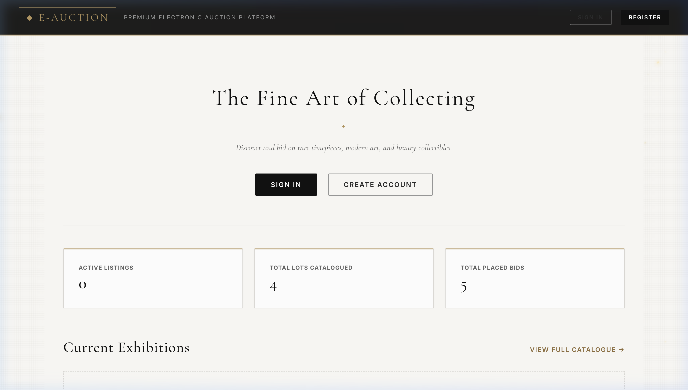
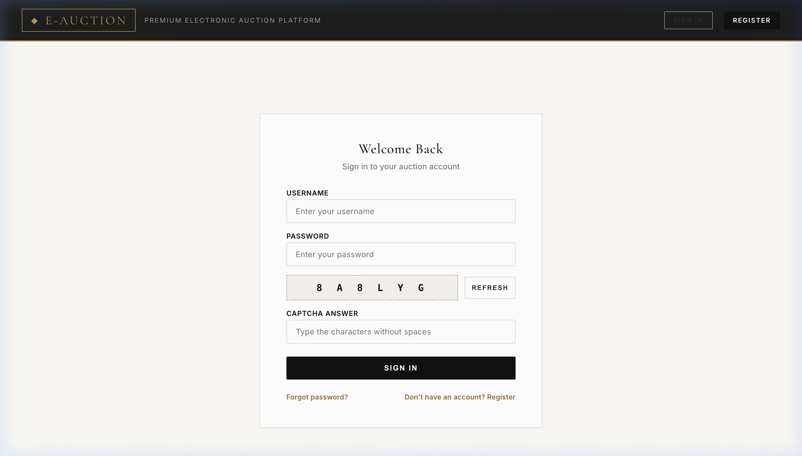
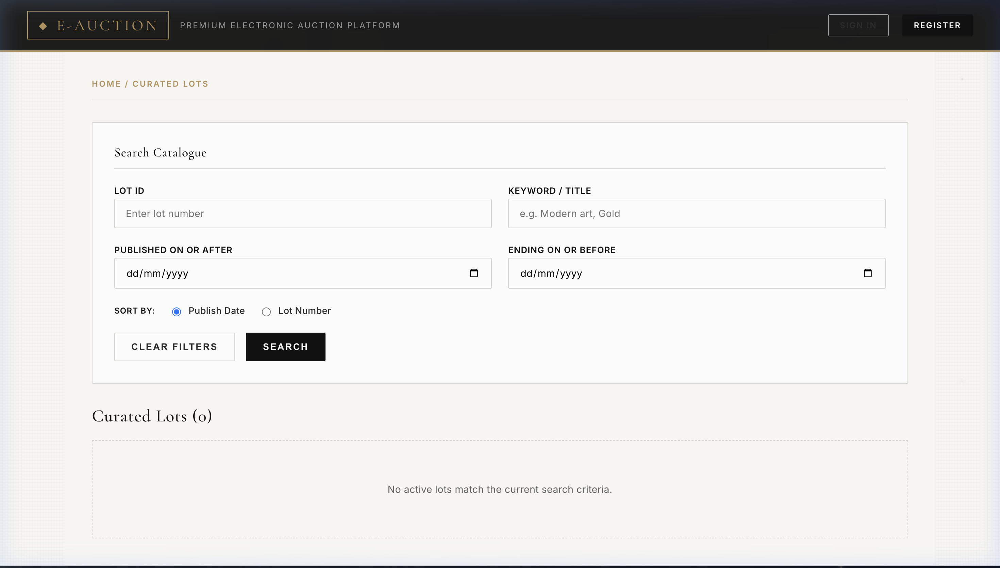

<p align="center">
  <strong>◆ E-AUCTION</strong><br/>
  <em>A Premium Electronic Auction Platform</em>
</p>

<p align="center">
  
  
  
  
  
</p>

---

## 📋 About

**eAuction** is a full-stack online auction platform where users can list items, place bids in real time, and track auction outcomes — all secured with JWT-based authentication and role-based access control.

Built with a **Spring Boot** REST API backend and a **React** single-page frontend, featuring a luxury-themed dark UI with animated auction outcomes (SOLD, UNSOLD, Winner Celebration).

<p align="center">
  
</p>

---

## ✨ Features

### 🔐 Authentication & Security
- JWT access tokens with refresh token rotation
- BCrypt password hashing
- Math-based CAPTCHA challenge on sign-up
- Forgot / reset password workflow
- Rate limiting on sensitive endpoints
- Role-based access control (Bidder, Auctioneer, Admin)

### 🏷️ Auction Management
- Create auctions with item name, description, category, image upload, start price, and scheduling
- Automatic auction closeout via a scheduled background task (every 60 seconds)
- Real-time countdown timer on auction detail pages
- Search and filter active auctions

### 💰 Bidding System
- Place bids on active auctions with validation (must exceed current highest bid)
- Live bid history panel with bidder names and timestamps
- Animated bid success feedback (flash + toast + sparkle burst)

### 🎬 Auction Outcome Animations
| Scenario | Animation |
|----------|-----------|
| Auction sold with bids | 🔴 **SOLD** stamp overlay with confetti |
| No bids placed | 🔨 **UNSOLD** gavel animation with dust particles |
| You won the auction | 🏆 **Winner Celebration** with golden confetti and trophy |

### 📦 Order & Payment
- Automatic order creation when auctions close
- Order tracking for buyers and sellers
- Payment status management (Pending → Paid)

### 👤 User Dashboards
- **Bidder Dashboard** — Track bids placed, auctions won, and payment status
- **Auctioneer Dashboard** — Manage listed auctions and view sale results
- **Admin Dashboard** — System-wide oversight and user management

<p align="center">
  
  &nbsp;
  
</p>

---

## 🏗️ Architecture

```
┌─────────────────────────────────────────────────────────────┐
│                     React Frontend (:3000)                  │
│  ┌──────────┐ ┌──────────┐ ┌──────────┐ ┌──────────────┐   │
│  │  Pages   │ │Components│ │   Auth   │ │  Theme/CSS   │   │
│  └────┬─────┘ └────┬─────┘ └────┬─────┘ └──────────────┘   │
│       └─────────────┼───────────┘                           │
│                     │ Axios HTTP                            │
└─────────────────────┼───────────────────────────────────────┘
                      │
                      ▼
┌─────────────────────────────────────────────────────────────┐
│               Spring Boot Backend (:8080)                   │
│  ┌──────────┐ ┌──────────┐ ┌──────────┐ ┌──────────────┐   │
│  │Controllers│ │ Services │ │Security  │ │  Scheduler   │   │
│  │  (REST)  │ │ (Logic)  │ │(JWT/RBAC)│ │ (Auto-close) │   │
│  └────┬─────┘ └────┬─────┘ └────┬─────┘ └──────────────┘   │
│       └─────────────┼───────────┘                           │
│                     │ Spring Data JPA                       │
└─────────────────────┼───────────────────────────────────────┘
                      │
                      ▼
              ┌───────────────┐
              │   MySQL 8.0   │
              │  auction_db   │
              └───────────────┘
```

---

## 🚀 Getting Started

### Prerequisites

| Tool | Version |
|------|---------|
| Java JDK | 25+ |
| Node.js | 18+ |
| npm | 9+ |
| MySQL | 8.0+ |
| Maven | 3.9+ (or use the included `mvnw` wrapper) |

### 1. Clone the Repository

```bash
git clone https://github.com/GauravMishra06/Auction_System.git
cd Auction_System
```

### 2. Set Up MySQL Database

```sql
CREATE DATABASE auction_db;
```

### 3. Configure the Backend

```bash
cd Auction_System

# Copy the environment template
cp .env.example .env

# Edit .env with your local credentials:
#   DB_PASSWORD=your_mysql_password
#   APP_JWT_SECRET=your_256bit_secret_key
```

### 4. Run the Backend

```bash
./mvnw spring-boot:run
```

The API will start at **http://localhost:8080**

### 5. Run the Frontend

```bash
cd ../auction_system_frontend
npm install
npm start
```

The app will open at **http://localhost:3000**

---

## 📡 API Reference

### Authentication
| Method | Endpoint | Description | Auth |
|--------|----------|-------------|------|
| `POST` | `/api/auth/signup` | Register a new user | ✗ |
| `POST` | `/api/auth/signin` | Sign in, get JWT tokens | ✗ |
| `POST` | `/api/auth/refresh-token` | Refresh access token | ✗ |
| `POST` | `/api/auth/forgot-password` | Request password reset | ✗ |
| `POST` | `/api/auth/reset-password` | Reset password with token | ✗ |
| `POST` | `/api/auth/captcha/generate` | Generate CAPTCHA challenge | ✗ |

### Auctions
| Method | Endpoint | Description | Auth |
|--------|----------|-------------|------|
| `GET` | `/api/auctions/active` | List active auctions | ✗ |
| `GET` | `/api/auctions/completed` | List completed auctions | ✗ |
| `GET` | `/api/auctions/{id}` | Get auction details | ✗ |
| `GET` | `/api/auctions/search` | Search auctions | ✗ |
| `POST` | `/api/auctions` | Create a new auction | ✓ Auctioneer/Admin |

### Bidding
| Method | Endpoint | Description | Auth |
|--------|----------|-------------|------|
| `POST` | `/api/bids/place` | Place a bid | ✓ Bidder |
| `GET` | `/api/bids/history/{auctionId}` | Get bid history | ✗ |

### Orders
| Method | Endpoint | Description | Auth |
|--------|----------|-------------|------|
| `GET` | `/api/orders/{id}` | Get order by ID | ✓ |
| `GET` | `/api/orders/auction/{auctionId}` | Get order by auction | ✓ |
| `GET` | `/api/orders/my-wins` | Get current user's won orders | ✓ |
| `GET` | `/api/orders/my-sales` | Get current user's sales | ✓ |
| `PATCH` | `/api/orders/{id}/pay` | Mark order as paid | ✓ Winner |

### Users
| Method | Endpoint | Description | Auth |
|--------|----------|-------------|------|
| `GET` | `/api/users/profile` | Get current user profile | ✓ |

---

## 📁 Project Structure

```
Auction_System/
├── Auction_System/                    # Spring Boot Backend
│   ├── src/main/java/.../
│   │   ├── component/                 # Scheduled tasks (auction auto-close)
│   │   ├── config/                    # CORS configuration
│   │   ├── controller/                # REST API controllers
│   │   ├── dto/                       # Data Transfer Objects
│   │   │   └── auth/                  # Auth-specific DTOs
│   │   ├── exception/                 # Custom exception classes
│   │   ├── models/                    # JPA entities
│   │   │   └── enums/                 # Role, AuctionStatus, OrderStatus
│   │   ├── repository/                # Spring Data JPA repositories
│   │   ├── security/                  # JWT filter, config, user details
│   │   └── service/                   # Business logic layer
│   ├── src/main/resources/
│   │   └── application.properties     # Spring Boot configuration
│   ├── .env.example                   # Environment variable template
│   └── pom.xml                        # Maven dependencies
│
├── auction_system_frontend/           # React Frontend
│   ├── public/                        # Static assets
│   ├── src/
│   │   ├── auth/                      # Auth context & token management
│   │   ├── components/                # Reusable UI components
│   │   │   ├── AuctionCard.js         # Auction listing card
│   │   │   ├── BackgroundManager.js   # Dynamic background
│   │   │   ├── GoldenSparkles.js      # Canvas particle effects
│   │   │   ├── ProtectedRoute.js      # Route guard with role check
│   │   │   ├── Sidebar.js             # Navigation sidebar
│   │   │   ├── SoldAnimation.js       # SOLD stamp animation
│   │   │   ├── UnsoldAnimation.js     # UNSOLD gavel animation
│   │   │   └── WinnerCelebration.js   # Winner confetti animation
│   │   ├── pages/                     # Route-level page components
│   │   ├── theme.css                  # Global design system
│   │   ├── index.css                  # Base styles
│   │   └── App.js                     # Root component with routing
│   └── package.json
│
├── screenshots/                       # README screenshots
└── .gitignore                         # Root-level git ignore rules
```

---

## 🛠️ Tech Stack

### Backend
| Technology | Purpose |
|------------|---------|
| Spring Boot 4.0.6 | REST API framework |
| Spring Security | Authentication & authorization |
| Spring Data JPA | ORM & database access |
| MySQL | Relational database |
| JJWT 0.12.6 | JWT token generation & validation |
| Lombok | Boilerplate reduction |
| BCrypt | Password hashing |
| dotenv-java | Environment variable management |

### Frontend
| Technology | Purpose |
|------------|---------|
| React 19 | UI library |
| React Router 7 | Client-side routing |
| Axios | HTTP client |
| CSS (Custom) | Luxury-themed design system |

---

## 👥 User Roles

| Role | Permissions |
|------|-------------|
| **Bidder** | Browse auctions, place bids, view won items, make payments |
| **Auctioneer** | Everything a Bidder can do + create & manage auctions |
| **Admin** | Full system access including user management |

---

## ⚙️ Environment Variables

| Variable | Description | Default |
|----------|-------------|---------|
| `DB_URL` | MySQL JDBC connection URL | `jdbc:mysql://localhost:3306/auction_db` |
| `DB_USERNAME` | Database username | `root` |
| `DB_PASSWORD` | Database password | — |
| `APP_JWT_SECRET` | JWT signing key (min 256-bit) | — |
| `APP_JWT_EXPIRATION_MS` | Access token TTL | `86400000` (24h) |
| `APP_JWT_REFRESH_EXPIRATION_MS` | Refresh token TTL | `604800000` (7d) |
| `APP_CAPTCHA_TTL_SECONDS` | CAPTCHA validity period | `120` |
| `APP_CORS_ALLOWED_ORIGIN` | Allowed frontend origin | `http://localhost:3000` |
| `APP_PASSWORD_RESET_EXPIRATION_MINUTES` | Reset token TTL | `30` |
| `APP_PASSWORD_RESET_FRONTEND_URL` | Frontend reset page URL | `http://localhost:3000/reset-password` |

---

## 📄 License

This project is open source and available under the [MIT License](LICENSE).

---

<p align="center">
  Built with ☕ Java & ⚛️ React<br/>
  <strong>eAuction</strong> — Curated Collections · Verified Sellers · Secure Payments
</p>
